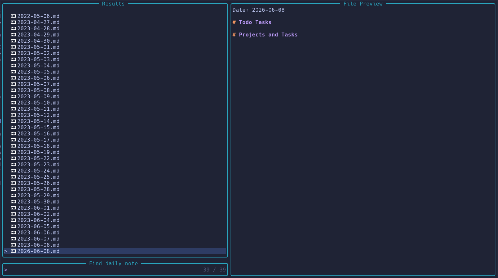
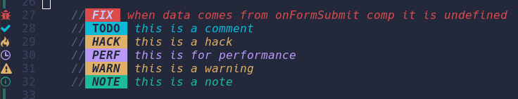

<h1>What My Neovim setup can do so far?</h1>

<h2>Note Taking</h2>
<ul>
    <li>Using checkboxes to create todo lists</li>
    <li>Search daily notes using Telescope</li>
    <li>Create Templates for notes and daily tasks</li>
</ul>

<h2>Git Integration</h2>
<ul>
    <li>I use lazygit for Integration with github</li>
    <li>I have also colour coded the different branches</li>
    <li>Uses Nerd fonts for the symbols</li>
    <li>When coding it places a line for what has changed in the file</li>
</ul>

<h2>Todo Comments</h2>
<ul>
    <li>Using the plugin called todo-comments.nvim</li>
    <li>This plugin gives an individual symbol for every different todo comment</li>
</ul>>

<h1>My configuration file for Lazygit</h1>

<h2>A simple discription</h2>
<ul>
    <li>There should be a file called config.yml</li>
    <li>Path to file: ~/.config/lazygit/config.yml</li>
</ul>

<h2>place the following in your config.yml file</h2>
gui:
  showIcons: true
  branchColors:
    'docs': '#11aaff'
    'develop': '#d6642b'
    'feat': '#38ebd6'
    'feature': '#38ebd6'
    'endpoint': '#f22235'
  mainBranches: ['main']

<h1>Installation Instructions</h1>

<h2>How I installed Neovim to my system</h2>

sudo snap install nvim --classic

<h2>ripgrep is used to search the current directory when using Telescope</h2>
Packages that need to be installed for certain plugins:
- Ripgrep: $ sudo apt-get install ripgrep
    This is for using Telescope

<h2>When you are wanting to load a live server for HTML documents?</h2>

Install browser-sync with npm

$ npm install -g browser-sync

